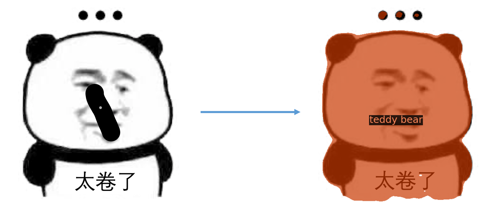
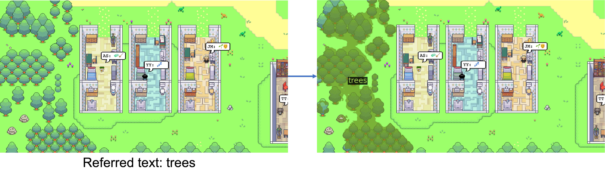

# 👀*SEEM:* Segment Everything Everywhere All at Once

:grapes: \[[Read our arXiv Paper](https://arxiv.org/pdf/2304.06718.pdf)\] &nbsp; :apple: \[[Try our Demo](http://semantic-sam.xyzou.net:6090/)\] 

We introduce **SEEM** that can **S**egment **E**verything **E**verywhere with **M**ulti-modal prompts all at once. SEEM allows users to easily segment an image using prompts of different types including visual prompts (points, marks, boxes, scribbles and image segments) and language prompts (text and audio), etc. It can also work with any combination of prompts or generalize to custom prompts!

by [Xueyan Zou*](https://maureenzou.github.io/), [Jianwei Yang*](https://jwyang.github.io/), [Hao Zhang*](https://scholar.google.com/citations?user=B8hPxMQAAAAJ&hl=en),  [Feng Li*](https://fengli-ust.github.io/), [Linjie Li](https://scholar.google.com/citations?user=WR875gYAAAAJ&hl=en), [Jianfeng Wang](http://jianfengwang.me/), [Lijuan Wang](https://scholar.google.com/citations?user=cDcWXuIAAAAJ&hl=zh-CN), [Jianfeng Gao^](https://www.microsoft.com/en-us/research/people/jfgao/?from=http%3A%2F%2Fresearch.microsoft.com%2Fen-us%2Fum%2Fpeople%2Fjfgao%2F), [Yong Jae Lee^](https://pages.cs.wisc.edu/~yongjaelee/), in **NeurIPS 2023**.

A brief introduction of all the generic and interactive segmentation tasks we can do!


## :rocket: Updates
* **[2023.11.2]**  SEEM is applied in [LLaVA-Interactive](https://llava-vl.github.io/llava-interactive/): an all-in-one demo for Image Chat, Segmentation, Generation and Editing. Experience the future of interactive image editing with visual chat.
[[Project Page](https://llava-vl.github.io/llava-interactive/)] [[Demo](https://6dd3-20-163-117-69.ngrok-free.app/)] [[Code](https://github.com/LLaVA-VL/LLaVA-Interactive-Demo)] [[Paper](https://arxiv.org/abs/2311.00571)]
* **[2023.10.23]**  SEEM is used in [Set-of-Mark Prompting](https://som-gpt4v.github.io/): a brand-new visual prompting technique for GPT-4V! It totally unleashes the extraordinary visual grounding power of GPT-4V!
[[Project Page](https://github.com/microsoft/SoM)] [[Code](https://github.com/microsoft/SoM)] [[Paper](https://arxiv.org/abs/2310.11441)]
* **[2023.10.10]** We release the training [log](https://huggingface.co/xdecoder/SEEM/raw/main/seem_v1_focall_unicl.log) for SEEM-Large-v1 and [log](https://huggingface.co/xdecoder/SEEM/raw/main/seem_v1_focalt_unicl.log) for SEEM-Tiny-v1!
* **[2023.10.04]** We are excited to release :white_check_mark: [training/evaluation/demo code](https://github.com/UX-Decoder/Segment-Everything-Everywhere-All-At-Once/edit/v1.0/README.md#bookmark_tabs-catalog), :white_check_mark: [new checkpoints](https://github.com/UX-Decoder/Segment-Everything-Everywhere-All-At-Once/edit/v1.0/README.md#bookmark_tabs-catalog), and :white_check_mark: [comprehensive readmes](https://github.com/UX-Decoder/Segment-Everything-Everywhere-All-At-Once/edit/v1.0/README.md#bookmark_tabs-catalog) for ***both X-Decoder and SEEM***!
* **[2023.09.25]** Our work has been accepted to NeurIPS 2023!
* **[2023.07.27]** We are excited to release our [X-Decoder](https://github.com/microsoft/X-Decoder) training code! We will release its descendant SEEM training code very soon!
* **[2023.07.10]** We release [Semantic-SAM](https://github.com/UX-Decoder/Semantic-SAM), a universal image segmentation model to enable segment and recognize anything at any desired granularity. Code and checkpoint are available!
* **[2023.05.02]** We have released the [SEEM Focal-L](https://projects4jw.blob.core.windows.net/x-decoder/release/seem_focall_v1.pt) and [X-Decoder Focal-L](https://projects4jw.blob.core.windows.net/x-decoder/release/xdecoder_focall_last.pt) checkpoints and [configs](https://github.com/UX-Decoder/Segment-Everything-Everywhere-All-At-Once/blob/main/demo_code/configs/seem/seem_focall_lang.yaml)!
* **[2023.04.28]** We have updated the [ArXiv](https://arxiv.org/pdf/2304.06718.pdf) that shows *better interactive segmentation results than SAM*, which trained on x50 more data than us!
* **[2023.04.26]** We have released the [Demo Code](https://github.com/UX-Decoder/Segment-Everything-Everywhere-All-At-Once/tree/main/demo_code) and [SEEM-Tiny Checkpoint](https://projects4jw.blob.core.windows.net/x-decoder/release/seem_focalt_v1.pt)! Please try the One-Line Started!
* **[2023.04.20]** SEEM Referring Video Segmentation is out! Please try the [Video Demo](https://huggingface.co/spaces/xdecoder/SEEM) and take a look at the [NERF examples](https://github.com/UX-Decoder/Segment-Everything-Everywhere-All-At-Once#tulip-nerf-examples).

## :bookmark_tabs: Catalog
We release the following contents for **both SEEM and X-Decoder**:exclamation:
- [x] Demo Code
- [x] Model Checkpoint
- [x] Comprehensive User Guide
- [x] Training Code
- [x] Evaluation Code

:point_right: **One-Line SEEM Demo with Linux:**
```sh
git clone git@github.com:UX-Decoder/Segment-Everything-Everywhere-All-At-Once.git && sh assets/scripts/run_demo.sh
```

:round_pushpin: *[New]* **Getting Started:**

* [INSTALL.md](assets/readmes/INSTALL.md) <br>
* [DATASET.md](assets/readmes/DATASET.md) <br>
* [TRAIN.md](assets/readmes/TRAIN.md) <br>
* [EVAL.md](assets/readmes/EVAL.md)

:round_pushpin: *[New]* **Latest Checkpoints and Numbers:**
|                 |                                                                                      |          | COCO |      |      | Ref-COCOg |      |      | VOC   |       | SBD   |       |
|-----------------|---------------------------------------------------------------------------------------------|------------|------|------|------|-----------|------|------|-------|-------|-------|-------|
| Method          |  Checkpoint                                                                                  | Backbone | PQ &uarr;  | mAP &uarr; | mIoU &uarr; | cIoU  &uarr; | mIoU &uarr; | AP50 &uarr; | NoC85 &darr; | NoC90 &darr;| NoC85 &darr;| NoC90 &darr;|
| X-Decoder       |  [ckpt](https://huggingface.co/xdecoder/X-Decoder/resolve/main/xdecoder_focalt_last.pt) | Focal-T  | 50.8 | 39.5 | 62.4 | 57.6      | 63.2 | 71.6 | -     | -     | -     | -     |
| X-Decoder-oq201 |  [ckpt](https://huggingface.co/xdecoder/X-Decoder/resolve/main/xdecoder_focall_last.pt) | Focal-L  | 56.5 | 46.7 | 67.2 | 62.8      | 67.5 | 76.3 | -     | -     | -     | -     |
| SEEM_v0            | [ckpt](https://huggingface.co/xdecoder/SEEM/resolve/main/seem_focalt_v0.pt)      | Focal-T  | 50.6 | 39.4 | 60.9 | 58.5      | 63.5 | 71.6 | 3.54  | 4.59  | *     | *     |
| SEEM_v0            |  -                                                                                           | Davit-d3 | 56.2 | 46.8 | 65.3 | 63.2      | 68.3 | 76.6 | 2.99  | 3.89  | 5.93  | 9.23  |
| SEEM_v0      | [ckpt](https://huggingface.co/xdecoder/SEEM/resolve/main/seem_focall_v0.pt)       | Focal-L  | 56.2 | 46.4 | 65.5 | 62.8      | 67.7 | 76.2 | 3.04  | 3.85  | *     | *     |
| SEEM_v1      | [ckpt](https://huggingface.co/xdecoder/SEEM/resolve/main/seem_samvitb_v1.pt)       | SAM-ViT-B  | 52.0 | 43.5 | 60.2 | 54.1      | 62.2 | 69.3 | 2.53  | 3.23  | *     | *     |
| SEEM_v1       | [ckpt](https://huggingface.co/xdecoder/SEEM/resolve/main/seem_samvitl_v1.pt)       | SAM-ViT-L  | 49.0 | 41.6 | 58.2 | 53.8      | 62.2 | 69.5 | 2.40  | 2.96  | *     | *     |
| SEEM_v1      | [ckpt](https://huggingface.co/xdecoder/SEEM/resolve/main/seem_focalt_v1.pt)/[log](https://huggingface.co/xdecoder/SEEM/raw/main/seem_v1_focalt_unicl.log)       | Focal-T  | 50.8 | 39.4 | 60.7 |   58.5    |  63.7 | 72.0 | 3.19  | 4.13  | *     | *     |
| SEEM_v1      | [ckpt](https://huggingface.co/xdecoder/SEEM/blob/main/seem_focall_v1.pt)/[log](https://huggingface.co/xdecoder/SEEM/blob/main/seem_v1_focall_unicl.log)      | Focal-L  | 56.1 | 46.3 | 65.8 |   62.4    |  67.8 | 76.0 | 2.66  | 3.44  | *     | *     |

**SEEM_v0:** Supporting Single Interactive object training and inference <br>
**SEEM_v1:** Supporting Multiple Interactive objects training and inference

<div  align="center">    
  
     
</div>

:fire: **Related projects:**

* [FocalNet](https://github.com/microsoft/FocalNet) and [DaViT](https://github.com/dingmyu/davit) : We used FocalNet and DaViT as the vision backbones.
* [UniCL](https://github.com/microsoft/UniCL) : We used unified contrastive learning technique for learning image-text representations.
* [X-Decoder](https://github.com/microsoft/X-Decoder) : We built SEEM based on X-Decoder which is a generalist decoder that can do multiple tasks with one model only.

:fire: **Other projects you may find interesting:**
* [Semantic-SAM](https://github.com/UX-Decoder/Semantic-SAM), a universal image segmentation model to enable segment and recognize anything at any desired granularity
* [OpenSeed](https://github.com/IDEA-Research/OpenSeeD) : Strong open-set segmentation methods.
* [Grounding SAM](https://github.com/IDEA-Research/Grounded-Segment-Anything) : Combining Grounding DINO and Segment Anything; [Grounding DINO](https://github.com/IDEA-Research/GroundingDINO): A strong open-set detection model.
* [X-GPT](https://github.com/microsoft/X-Decoder/tree/xgpt) : Conversational Visual Agent supported by X-Decoder.
* [LLaVA](https://github.com/haotian-liu/LLaVA) : Large Language and Vision Assistant.

## :bulb: Highlights
Inspired by the appealing universal interface in LLMs, we are advocating a universal, interactive multi-modal interface for any type of segmentation with **ONE SINGLE MODEL**. We emphasize **4** important features of **SEEM** below.
1. **Versatility**: work with various types of prompts, for example, clicks, boxes, polygons, scribbles, texts, and referring image;
2. **Compositionaliy**: deal with any compositions of prompts;
3. **Interactivity**: interact with user in multi-rounds, thanks to the memory prompt of **SEEM** to store the session history;
4. **Semantic awareness**: give a semantic label to any predicted mask;

## :unicorn: How to use the demo
- Try our default examples first;
- Upload an image;
- Select at least one type of prompt of your choice (If you want to use referred region of another image please check "Example" and upload another image in referring image panel);
- Remember to provide the actual prompt for each prompt type you select, otherwise you will meet an error (e.g., remember to draw on the referring image);
- Our model by default support the **vocabulary** of COCO 80 categories, others will be classified to 'others' or misclassified. If you want to segment using open-vocabulary labels, include the text label in 'text' button after drawing scribbles.
- Click "Submit" and wait for a few seconds.

## :volcano: An interesting example
An example of Transformers. The referred image is the truck form of Optimus Prime. Our model can always segment Optimus Prime in target images no matter which form it is in. Thanks Hongyang Li for this fun example.

<div  align="center">    

</div>

## :tulip: NERF Examples
* Inspired by the example in [SA3D](https://github.com/Jumpat/SegmentAnythingin3D), we tried SEEM on NERF Examples and works well :)

<div  align="center">    
  
   
</div>

## :camping: Click, scribble to mask
With a simple click or stoke from the user, we can generate the masks and the corresponding category labels for it.


## :mountain_snow: Text to mask
SEEM can generate the mask with text input from the user, providing multi-modality interaction with human.


<!-- 
<div  align="center">    

</div> -->

## :mosque: Referring image to mask
With a simple click or stroke on the referring image, the model is able to segment the objects with similar semantics on the target images.


SEEM understands the spatial relationship very well. Look at the three zebras! The segmented zebras have similar positions with the referred zebras. For example, when the leftmost zebra is referred on the upper row, the leftmost zebra on the bottom row is segmented.


## :blossom: Referring image to video mask
No training on video data needed, SEEM works perfectly for you to segment videos with whatever queries you specify!


## :sunflower: Audio to mask
We use Whisper to turn audio into text prompt to segment the object. Try it in our demo!

<div  align="center">    

</div>

<!-- ## 🔥 Combination of different prompts to mask -->

## :deciduous_tree: Examples of different styles
An example of segmenting a meme.
<div  align="center">    

</div>

An example of segmenting trees in cartoon style.
<div  align="center">    

</div>

An example of segmenting a Minecraft image.
<div  align="center">    

</div>
<!--  -->
An example of using referring image on a popular teddy bear.


## Model


## Comparison with SAM
In the following figure, we compare the levels of interaction and semantics of three segmentation tasks (edge detection, open-set, and interactive segmentation). Open-set Segmentation usually requires a high level of semantics and does not require interaction. Compared with [SAM](https://arxiv.org/abs/2304.02643), SEEM covers a wider range of interaction and semantics levels.  For example, SAM only supports limited interaction types like points and boxes, while misses high-semantic tasks since it does not output semantic labels itself. The reasons are: First, SEEM has a unified prompt encoder that encodes all visual and language prompts into a joint representation space. In consequence, SEEM can support more general usages. It has potential to extend to custom prompts. Second, SEEM works very well on text to mask (grounding segmentation) and outputs semantic-aware predictions.
<div  align="center">    

</div>
<!-- This figure shows a comparison of our model with concurrent work SAM on the level of interactions and semantics. The x-axis and y-axis denote the level of interaction and semantics, respectively. Three segmentation tasks are shown, including Open-set Segmentation, Edge detection, and Interactive Segmentation. These tasks have different levels of interactions and semantics. For example, Open-set Segmentation usually requires a high level of semantics and does not require interaction. Compared with SAM, our model covers a wider range of interaction and semantics levels. For example, SAM only supports limited interaction types like points and boxes, while misses high-semantic tasks since it does not output semantic labels itself. Note that although we do not report edge detection results, our model can support it by simply converting masks to edges. -->

## :cupid: Acknowledgements
- We appreciate hugging face for the GPU support on demo!


<!-- ## Citation (update when paper is available on arxiv)
If you find this project helpful for your research, please consider citing the following BibTeX entry.
```BibTex

``` -->
